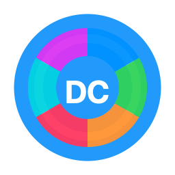

# DiskCheck

**Нативный анализатор диска для macOS** — визуализация занятого места в стиле DaisyDisk: интерактивный sunburst, дерево папок, умные категории и подсказки по очистке.

<p align="center">
  
</p>

<p align="center">
  
  
  
  
</p>

---

## О проекте

DiskCheck — это **десктопное приложение только для Mac**. Оно сканирует тома и папки, показывает, что занимает место, и помогает безопасно навести порядок: от `node_modules` и DerivedData до кэшей пакетных менеджеров и `.nosync`.

Проект разрабатывался в **[Cursor](https://cursor.com)** — AI-редакторе кода на базе VS Code. Весь исходный код открыт: вы можете скачать репозиторий, собрать `.app` у себя и пользоваться бесплатно.

> **Важно:** DiskCheck не публикуется в App Store. Сборка предназначена для локального использования на вашем Mac.

---

## Возможности

| Раздел | Что умеет |
|--------|-----------|
| **Sunburst** | Интерактивная круговая диаграмма с навигацией по уровням |
| **Дерево** | Список папок и файлов с размерами, хлебные крошки, ленивое раскрытие больших каталогов |
| **Категории** | Автоматическая группировка: Git, `node_modules`, DerivedData, кэши, логи, `.nosync` и др. |
| **ИИ** | Рекомендации по очистке через Apple Intelligence, Ollama или встроенные правила |
| **Корзина** | Промежуточная корзина перед удалением |
| **Диагностика** | SMART-статус диска, снимки Time Machine, анализ iCloud |
| **Menu Bar** | Быстрый доступ из строки меню macOS |

---

## Требования

- **macOS 14.0 (Sonoma)** или новее
- **Xcode 16+** с поддержкой Swift 6
- **Apple ID / Developer Team** для подписи (можно «Sign to Run Locally»)
- Для полного сканирования системного диска — **Полный доступ к диску** в настройках macOS

---

## Скачать и собрать

### 1. Клонировать репозиторий

```bash
git clone https://github.com/lomanoff/DiskCheck.git
cd DiskCheck
```

### 2. Открыть в Xcode

```bash
open DiskCheck.xcodeproj
```

В Xcode:

1. Выберите схему **DiskCheck**
2. **Signing & Capabilities** → включите *Automatically manage signing* и выберите свой Team
3. Соберите: **Product → Build** (`⌘B`)
4. Запустите: **Product → Run** (`⌘R`)

### 3. Сборка из терминала (Release)

```bash
xcodebuild \
  -scheme DiskCheck \
  -configuration Release \
  -destination 'platform=macOS' \
  build
```

Готовое приложение появится в:

```
~/Library/Developer/Xcode/DerivedData/DiskCheck-*/Build/Products/Release/DiskCheck.app
```

Скопировать на Рабочий стол:

```bash
cp -R ~/Library/Developer/Xcode/DerivedData/DiskCheck-*/Build/Products/Release/DiskCheck.app ~/Desktop/
```

### 4. Запуск тестов

```bash
xcodebuild -scheme DiskCheck -destination 'platform=macOS' test
```

### 5. (Опционально) Перегенерировать Xcode-проект

Если меняли `project.yml`, установите [XcodeGen](https://github.com/yonaskolb/XcodeGen) и выполните:

```bash
xcodegen generate
```

---

## Первый запуск

1. Запустите `DiskCheck.app`
2. Выберите том (например, **Macintosh HD**) и нажмите **Сканировать**
3. Для доступа ко всем системным папкам откройте:

   **Системные настройки → Конфиденциальность и безопасность → Полный доступ к диску**

   Добавьте собранный `DiskCheck.app` и **перезапустите** приложение.

4. Можно сканировать отдельную папку через кнопку выбора или drag & drop

---

## Структура проекта

```
DiskCheck/
├── DiskCheck/              # Исходники приложения
│   ├── Sources/
│   │   ├── App/            # Точка входа
│   │   ├── Features/       # UI: Main, Sunburst, Sidebar, MenuBar
│   │   ├── Models/         # DiskNode, категории, прогресс скана
│   │   ├── Services/       # Сканер, классификатор, ИИ-провайдеры
│   │   ├── Stores/         # Состояние скана и корзины
│   │   └── Utilities/      # FDA, форматирование, интеграции
│   ├── Assets.xcassets/    # Иконка приложения
│   └── Info.plist
├── Tests/                  # Unit-тесты
├── Config/                 # xcconfig, ExportOptions
├── Scripts/                # Генерация иконки, архив
└── project.yml             # XcodeGen-манифест
```

---

## Технологии

- **Swift 6** + **SwiftUI** + **Observation**
- Многопоточное сканирование с лимитом параллелизма
- Кэш дерева скана в Application Support
- Apple Intelligence / Ollama / rule-based советник по удалению
- Hardened Runtime (без App Sandbox — для полного доступа к диску при локальной сборке)

---

## Сделано в Cursor

Этот проект создан и развивается с помощью **Cursor** — редактора, где AI помогает писать, рефакторить и отлаживать код прямо в IDE. Если вы клонируете репозиторий, откройте папку в Cursor или Xcode и продолжайте разработку в привычном окружении.

---

## Лицензия

Исходный код предоставляется как есть, без гарантий. Используйте на свой страх и риск; перед удалением файлов проверяйте, что они вам не нужны.

---

<p align="center">
  <sub>DiskCheck · LOMO Studios · 2026</sub>
</p>
